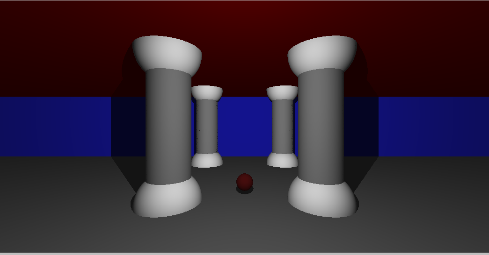

# miniRT



miniRT is a simple C based ray tracing project. It includes a custom implementation of the MiniLibX library for rendering graphics. Application supports rendering of 3 simple geometric objects: plane, sphere, cylinder.

## Building the Project

To build the project you need to run bash command:

```sh
make
```
## Running the Project

### Scenes

Scene file should have extension .rt.
Description of each object could be made in any order but must be separated by new line symbol.
List of available objects:
1. Ambient lightning:
- identifier: A
- ambient lighting ratio in range [0.0,1.0]: 0.2
- R,G,B colors in range [0-255]: 255, 255, 255

```
	A 0.2 255,255,255
```
2. Camera:
- identifier: C
- x,y,z coordinates of the view point: -50.0,0,20
- 3d normalized orientation vector. In range [-1,1] for each x,y,z axis:
0.0,0.0,1.0
- FOV : Horizontal field of view in degrees in range [0,180]: 70

```
	C -50.0,0,20 0,0,1 70
```

3. Light:
- identifier: L
- x,y,z coordinates of the light point: -40.0,50.0,0.0
- the light brightness ratio in range [0.0,1.0]: 0.6
- (unused in mandatory part)R,G,B colors in range [0-255]: 10, 0, 255

```
	L -40.0,50.0,0.0 0.6 10,0,255
```

4. Sphere:

- identifier: sp
- x,y,z coordinates of the sphere center: 0.0,0.0,20.6
- the sphere diameter: 12.6
- R,G,B colors in range [0-255]: 10, 0, 255

```
	sp 0.0,0.0,20.6 12.6 10,0,255
```

5. Plane:

- identifier: pl
- x,y,z coordinates of a point in the plane: 0.0,0.0,-10.0
- 3d normalized normal vector. In range [-1,1] for each x,y,z axis: 0.0,1.0,0.0
- R,G,B colors in range [0-255]: 0,0,225

```
	pl 0.0,0.0,-10.0 0.0,1.0,0.0 0,0,225
```
6. Cylinder:

- identifier: cy
- x,y,z coordinates of the center of the cylinder: 50.0,0.0,20.6
- 3d normalized vector of axis of cylinder. In range [-1,1] for each x,y,z axis:
0.0,0.0,1.0
- the cylinder diameter: 14.2
- the cylinder height: 21.42
- R,G,B colors in range [0,255]: 10, 0, 255

```
	cy 50.0,0.0,20.6 0.0,0.0,1.0 14.2 21.42 10,0,255
```
You can find examples of scenes in ./scenes folder.


### Running minirt

After building the project, you can run the miniRT executable:

Replace [scene_file] with the path to a scene file located in the scenes directory.

### Interaction with rendered data

Project allows user to interact with preset data by scene file.
User can change position of Camera, Objects and Light source in real time.
To chose object for manipulation press button:
- C to choose Camera
- L to choose Light source
- O to choose objects.

To chose coordinate axis which will be used for transition press button:
- X
- Y
- Z

With a help of arrow buttons user can change position of chosen entity.

To close window you can press Esc or cross button.

## Cleaning Up
To clean up the build files, you can run make fclean in root directory:
